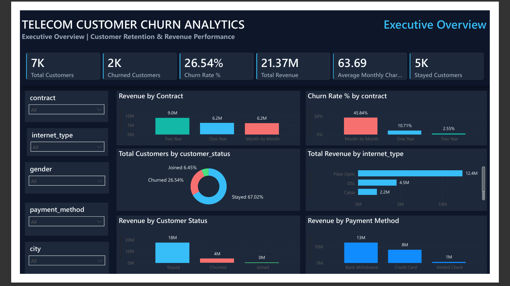
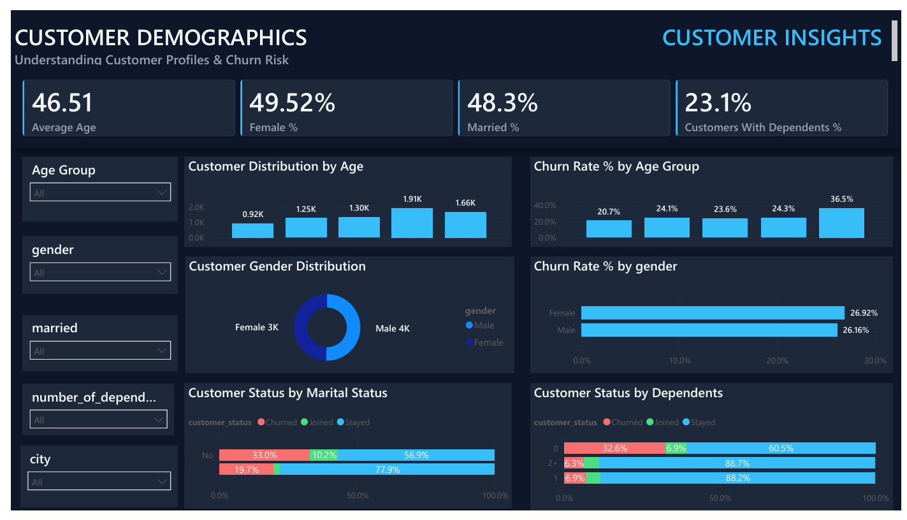
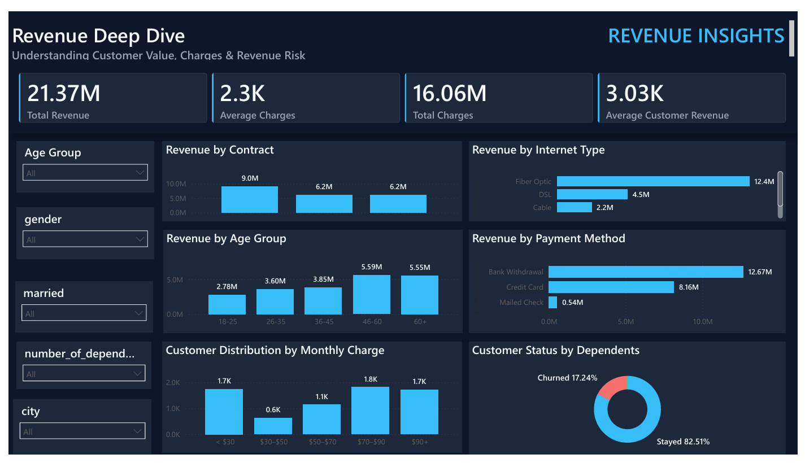
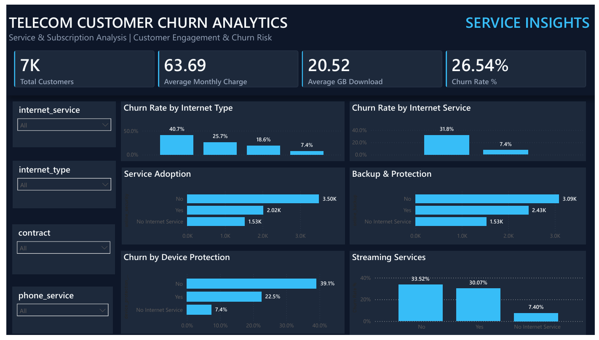
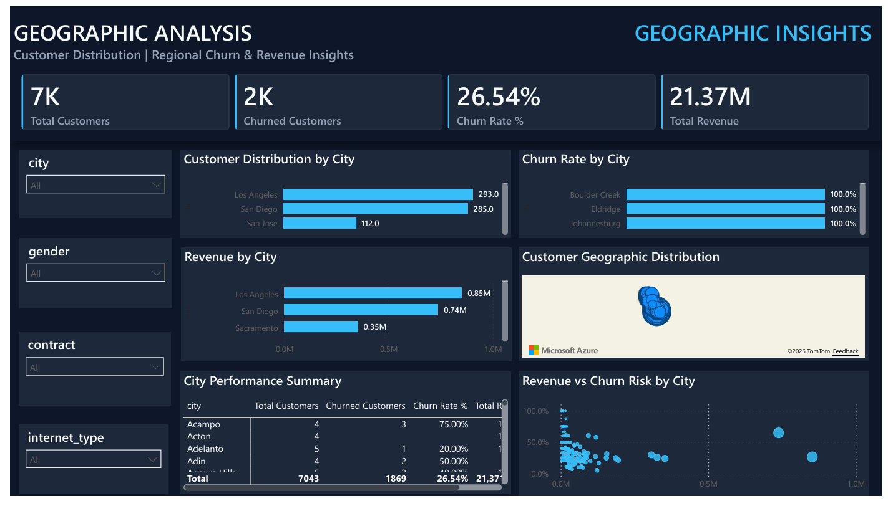
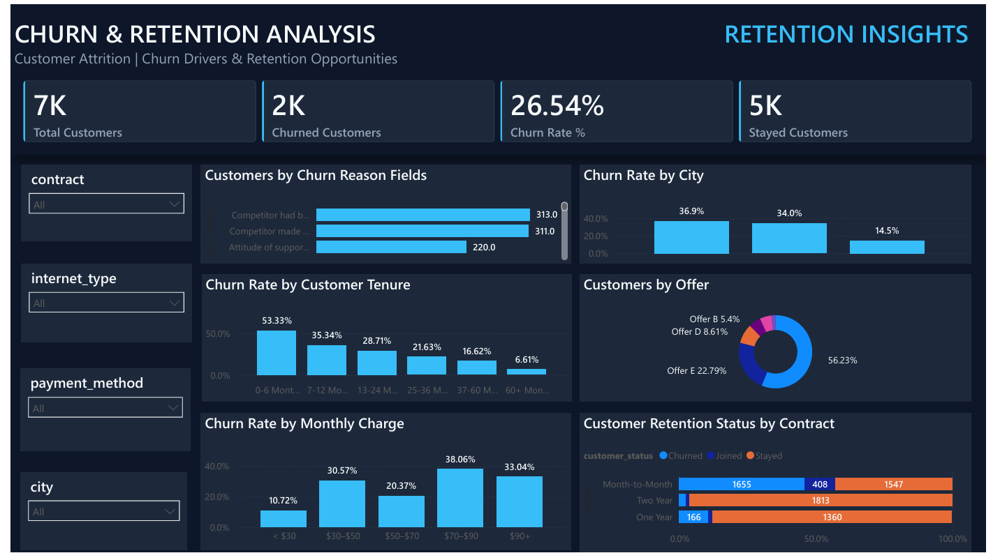
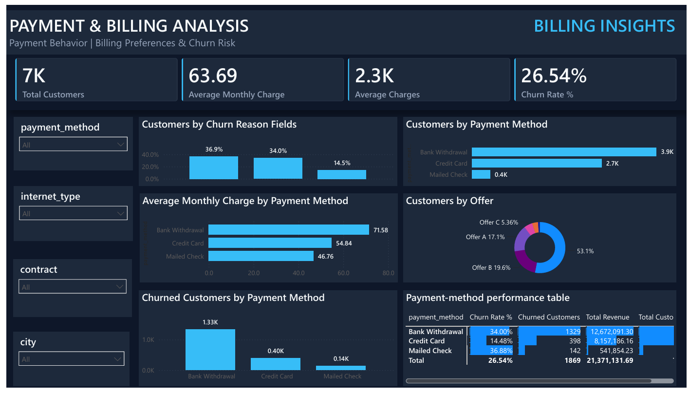
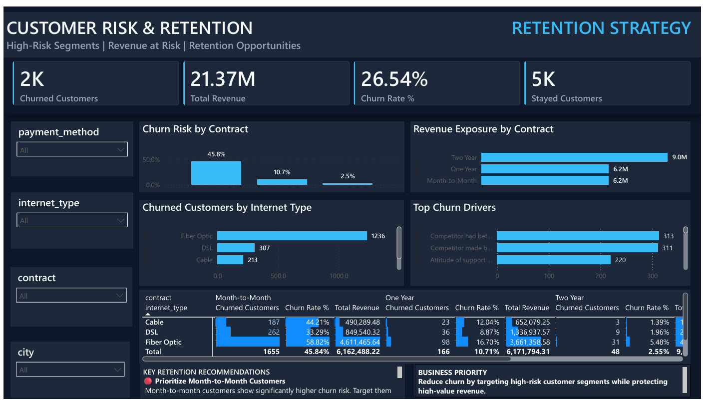

# 📊 Telecom Customer Churn Analytics

An end-to-end data analytics project analyzing customer churn, revenue, service adoption, customer behavior, and retention opportunities using **Python, PostgreSQL, and Power BI**.

---

## 📌 Project Overview

Customer churn is a major challenge for telecom companies because losing customers directly impacts recurring revenue and customer lifetime value.

This project analyzes telecom customer data to:

- Identify churn patterns
- Understand major churn drivers
- Identify high-risk customer segments
- Analyze revenue and service behavior
- Evaluate customer retention opportunities
- Provide actionable business recommendations

### End-to-End Workflow

**Python → Data Cleaning & EDA → PostgreSQL → SQL Analysis → Power BI → Business Insights**

---
## 🧭 Project Navigation

| Section | Description |
|---|---|
| 🐍 [Python EDA](notebooks/Telecom_Customer_Churn_EDA.ipynb) | Data cleaning, EDA and visualization |
| 🧮 [SQL Analysis](sql/) | PostgreSQL business analysis |
| 📊 [Power BI Screenshots](screenshots/) | 8-page interactive dashboard |
| 💡 [Business Insights](#-key-business-insights) | Major findings |
| 🎯 [Recommendations](#-business-recommendations) | Retention strategies |

## 🎯 Business Problem

The telecom company wants to understand:

- What percentage of customers are churning?
- Which customer segments have the highest churn?
- Which contract types are associated with higher churn?
- Which services are linked to customer attrition?
- What are the major reasons customers leave?
- Does monthly charge influence churn?
- Which payment methods have higher churn?
- Which geographic areas have higher churn?
- Which customer segments should be prioritized for retention?

---

## 🎯 Project Objectives

- Calculate the overall customer churn rate
- Identify major churn drivers
- Analyze churn across customer demographics
- Analyze churn by contract and subscription type
- Understand service adoption and its relationship with churn
- Analyze revenue and monthly charge patterns
- Identify geographic churn patterns
- Analyze payment and billing behavior
- Identify high-risk customer segments
- Provide actionable retention recommendations

---

## 🗂️ Dataset

The final cleaned dataset contains **7,043 customers and 38 columns**.

### Data Categories

| Category | Examples |
|---|---|
| Customer | customer_id, gender, age, married |
| Geography | city, zip_code, latitude, longitude |
| Services | phone_service, internet_service, internet_type |
| Subscription | contract, paperless_billing |
| Billing | monthly_charge, total_charges |
| Revenue | total_revenue, total_refunds |
| Churn | customer_status, churn_category, churn_reason |

### Dataset Quality

| Metric | Value |
|---|---:|
| Customers | 7,043 |
| Columns | 38 |
| Duplicate Rows | 0 |
| Duplicate Customer IDs | 0 |
| Overall Churn Rate | 26.54% |

---

## 🛠️ Tools & Technologies

| Tool | Purpose |
|---|---|
| Python | Data generation, cleaning and analysis |
| Pandas | Data manipulation and analysis |
| NumPy | Numerical analysis |
| Matplotlib | Data visualization |
| Jupyter Notebook | Exploratory Data Analysis |
| PostgreSQL | Database and SQL analysis |
| SQL | Business analysis |
| Power BI | Interactive dashboard and visualization |
| Power Query | Data transformation |
| DAX | KPI and business metric calculations |
| VS Code | Development |
| Anaconda | Python environment |
| Git / GitHub | Version control and documentation |

---

## 🔄 Data Analysis Workflow

### 1. Data Generation & Collection

Created a realistic telecom customer dataset containing:

- Customer demographics
- Geographic information
- Telecom services
- Contract information
- Billing information
- Revenue information
- Customer status
- Churn category and churn reason

### 2. Data Cleaning

Performed data quality checks for:

- Missing values
- Duplicate records
- Duplicate customer IDs
- Invalid numerical values
- Inconsistent categorical values
- Invalid charge values
- Missing service-related attributes
- Data type consistency

### 3. Exploratory Data Analysis

Analyzed:

- Customer demographics
- Age groups
- Gender
- Marital status
- Number of dependents
- Customer tenure
- Contract type
- Internet service
- Internet type
- Service adoption
- Monthly charges
- Total charges
- Customer revenue
- Payment methods
- Customer status
- Churn categories
- Churn reasons
- Geographic distribution

### 4. SQL Analysis

Loaded the analytical data into PostgreSQL and used SQL to:

- Answer business questions
- Calculate customer and revenue metrics
- Analyze customer segments
- Analyze churn by different dimensions
- Identify high-risk segments

### 5. Power BI

Built an interactive Power BI dashboard using:

- Data modeling
- DAX measures
- KPI cards
- Slicers
- Cross-filtering
- Bar charts
- Donut charts
- Tables and matrices
- Geographic visuals

### 6. Business Insights

Used the analysis to:

- Identify high-risk customer segments
- Identify major churn drivers
- Evaluate revenue exposure
- Develop customer retention recommendations

---

## 📊 Power BI Dashboard

The Power BI dashboard contains **8 analytical pages**.

| Page | Analysis |
|---|---|
| 1 | Executive Overview |
| 2 | Customer Demographics |
| 3 | Revenue Deep Dive |
| 4 | Service & Subscription Analysis |
| 5 | Geographic Analysis |
| 6 | Churn & Retention Analysis |
| 7 | Payment & Billing Analysis |
| 8 | Customer Risk & Retention Strategy |

### Key KPIs

- Total Customers
- Churned Customers
- Churn Rate %
- Stayed Customers
- Total Revenue
- Average Monthly Charge
- Average Total Charges
- Average Data Usage

---

## 📸 Dashboard Preview

> Add your Power BI screenshots to the `screenshots/` folder using the filenames below.

### 1. Executive Overview



### 2. Customer Demographics



### 3. Revenue Deep Dive



### 4. Service & Subscription Analysis



### 5. Geographic Analysis



### 6. Churn & Retention Analysis



### 7. Payment & Billing Analysis



### 8. Customer Risk & Retention Strategy



---

## 💡 Key Business Insights

### 1. Overall Churn

The overall customer churn rate is **26.54%**, indicating a significant customer retention challenge.

### 2. Contract Risk

Month-to-month customers show substantially higher churn than customers on one-year and two-year contracts.

The month-to-month segment has a churn rate of approximately **45.84%**.

### 3. Customer Tenure

Customers with shorter tenure show higher churn risk, highlighting the importance of early-stage customer engagement and retention.

### 4. Internet Service

Fiber Optic customers represent a significant portion of churned customers and should be investigated from service quality, pricing, and customer experience perspectives.

### 5. Monthly Charges

Higher monthly charge groups show higher churn rates, indicating an opportunity to identify customers who perceive insufficient value for their monthly cost.

### 6. Payment Behavior

Churn patterns vary across payment methods, creating opportunities for targeted billing and payment-related retention strategies.

### 7. Retention Opportunity

Month-to-month customers with higher charges and elevated churn risk represent an important segment for targeted retention campaigns.

---

## 🎯 Business Recommendations

### 1. Target Month-to-Month Customers

Provide incentives and value-based offers to encourage high-risk customers to move to longer-term contracts.

### 2. Focus on New Customers

Develop onboarding and engagement programs for customers during their early tenure.

### 3. Protect High-Value Customers

Prioritize retention campaigns for customers with high revenue contribution and elevated churn risk.

### 4. Investigate Fiber Optic Churn

Review service quality, pricing, technical support, and customer experience among Fiber Optic customers.

### 5. Develop Payment-Based Retention Strategies

Analyze payment behavior and provide suitable billing options or incentives for high-risk segments.

### 6. Build Customer Risk Segmentation

Use contract, tenure, service usage, monthly charges, and revenue contribution to prioritize retention campaigns.

---

## 🧮 SQL Business Analysis

PostgreSQL was used for business-focused analysis including:

- Overall customer churn rate
- Churn by contract type
- Churn by internet service
- Revenue by contract
- Revenue by city
- Customer tenure analysis
- Payment method analysis
- High-risk customer identification
- Customer retention analysis
- Revenue exposure by customer segment

---

## 🧹 Data Quality & Cleaning

The dataset was validated before analysis.

### Quality Checks

- Duplicate rows checked
- Duplicate customer IDs checked
- Missing values analyzed
- Invalid values identified
- Numeric columns validated
- Categorical values standardized
- Geographic fields validated
- Churn-related fields checked for logical consistency

### Final Dataset

- **7,043 customers**
- **38 columns**
- **0 duplicate rows**
- **0 duplicate customer IDs**

Missing values were handled according to their business meaning rather than simply removing records.

---

## 🏗️ Project Architecture

```text
Raw Telecom Data
       ↓
Python / Pandas
       ↓
Data Cleaning & Transformation
       ↓
Exploratory Data Analysis
       ↓
PostgreSQL
       ↓
SQL Business Analysis
       ↓
Power BI Data Model
       ↓
DAX Measures
       ↓
Dashboard
       ↓
Business Insights
       ↓
Retention Recommendations
```

---

## 📁 Project Structure

```text
Telecom-Customer-Churn-Analytics/
│
├── README.md
│
├── notebooks/
│   ├── README.md
│   └── Telecom_Customer_Churn_EDA.ipynb
│
├── sql/
│   ├── README.md
│   ├── 01_customer_overview.sql
│   ├── 02_churn_analysis.sql
│   ├── 03_revenue_analysis.sql
│   ├── 04_service_analysis.sql
│   └── 05_retention_analysis.sql
│
└── screenshots/
    ├── executive_overview.png
    ├── customer_demographics.png
    ├── revenue_deep_dive.png
    ├── service_subscription.png
    ├── geographic_analysis.png
    ├── churn_retention.png
    ├── payment_billing.png
    └── retention_strategy.png
```

> Keep this project structure section synchronized with the actual files and folders in the repository.

---

---

# 2. Add Project Resources

Immediately **after** the Project Structure section, add:

```markdown
## 🔗 Project Resources

### 🐍 Python / EDA

[📓 Open Python EDA Notebook](notebooks/Telecom_Customer_Churn_EDA.ipynb)

The notebook contains data cleaning, exploratory data analysis, statistical summaries, visualizations, and business insights.

### 🧮 SQL Analysis

[📂 View SQL Analysis](sql/)

The SQL folder contains PostgreSQL queries for:

- Customer overview
- Churn analysis
- Revenue analysis
- Service & subscription analysis
- Retention analysis

### 📊 Power BI Dashboard

[🖼️ View Dashboard Screenshots](screenshots/)

The screenshots folder contains all 8 Power BI dashboard pages.
## 🚀 Future Improvements

Potential future enhancements include:

- Customer churn prediction using Machine Learning
- Customer Lifetime Value analysis
- Churn probability scoring
- Automated Power BI refresh
- Customer segmentation using clustering
- Retention campaign ROI analysis
- Predictive revenue-at-risk analysis

---

## 👤 Author

**Abhishek Raghuvanshi**

**Data Analyst | Power BI | SQL | Python | Excel**

Focused on turning business data into actionable insights using:

**Python | SQL | Power BI | Excel | DAX | PostgreSQL**

- GitHub: [Abhishek Raghuvanshi](https://github.com/abhishekr27)
- LinkedIn: [Add your LinkedIn profile here](#)

---

⭐ If you found this project useful, feel free to explore the repository and connect with me.
